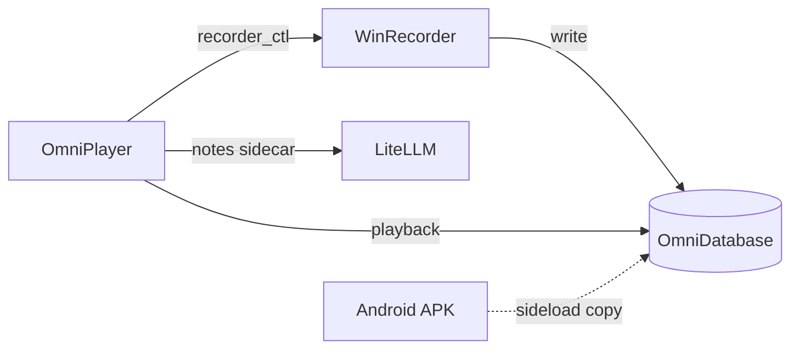

[中文](README.md) | **English**

<p align="center">
  
</p>

<h1 align="center">OmniTrace</h1>

<p align="center"><strong>Prajna Plan</strong> (般若计划) · local-first Windows capture, replay, and notes</p>

<p align="center">
  <a href="LICENSE"></a>
  <a href="https://github.com/Fortda/omnitrace"></a>
</p>

Repo: <https://github.com/Fortda/omnitrace> · License: [MIT](LICENSE)

By default everything is written under local `OmniDatabase/`. **Nothing is uploaded.** Do not commit API keys, cookies, recordings, or the database.

## Interface (schematic)

A **schematic** of the four-tab OmniPlayer chrome (cream paper, not a product screenshot). Real captures will land when we have an empty, privacy-safe workspace — see [docs/images](docs/images/README.md). `settings.png` / `player.png` / `dashboard.png` / `notes.png` are not in the tree yet.



Opened as a file, the SVG cycles the four tabs. GitHub’s README `` often shows the first frame only. This is not a product demo GIF.

## What it does

- **WinRecorder** (`omnitrace_input.exe`): background physical mouse/keyboard stream and window environment. Closing the shell does not stop recording.
- **OmniPlayer**: settings, replay / live tail, dashboard, streaming notes and clue boards.
- **Android** (`omnitrace_android/`): sideloaded capture APK. Not wired into the Windows shell in this period.

About-box line: intelligence and information capture, plus a run log of the phenomenal world model.

## Architecture

The player starts and stops the recorder. Data lives in `OmniDatabase/`. Notes talk to LiteLLM through a sidecar. Full contracts (currently in Chinese): [docs/architecture/OVERVIEW.md](docs/architecture/OVERVIEW.md).



## Install (Windows)

Stable install goes to `%LOCALAPPDATA%\OmniTrace`:

```powershell
.\scripts\install-stable.ps1
# or
.\omniplayer\package.ps1 -Install
```

GitHub **Release → Assets** are planned as: NSIS installer + portable zip (the zip does **not** include `OmniDatabase/`). How we cut a release: [docs/releasing.md](docs/releasing.md).

Development: `打开 OmniTrace.bat` at the repo root, or `cd omniplayer && npm run tauri dev`. The recorder is a detached background process; quitting the shell does not stop it.

## Docs

| Doc | Audience |
|-----|----------|
| [README.md](README.md) | Chinese intro |
| [README.en.md](README.en.md) | English intro |
| [CHANGELOG.md](CHANGELOG.md) | What changed in a release |
| [docs/architecture/](docs/architecture/README.md) | How the system is shaped (overview in Chinese) |
| [docs/adr/](docs/adr/README.md) | Why we chose it (ADRs) |
| [docs/releasing.md](docs/releasing.md) | Tags, Release Assets, first public orphan push |

## Roadmap

Mentioned here only — not implemented yet:

- **Batch import of e-wallet statements** (files stay on disk; not uploaded)
- **Recorder / player module plugin ABI** (paired interfaces: third-party modules write on the capture side and enact an agreed visualization / window architecture in OmniPlayer; the built-in module list is not a hot-load workshop)
- **Dashboard workshop** (share/install interfaces for stats charts and dashboard views — modules, charts, layouts; user traces are not uploaded by default)

Local-first stays the rule: capture, notes, and any future bill import do not ship the library to someone else's server. A later sharing platform would still not upload `OmniDatabase` by default.

## Contributing

Bugs and ideas: [GitHub Issues](https://github.com/Fortda/omnitrace/issues). The in-app Feedback button opens the same place.

Keep `OmniDatabase/`, secrets, recordings, and prompt files on your machine. If you add real screenshots, use an empty workspace — [docs/images/README.md](docs/images/README.md).

## License

[MIT](LICENSE) © 2026 Fortda
