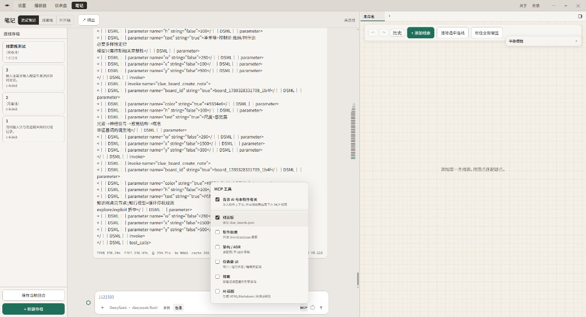
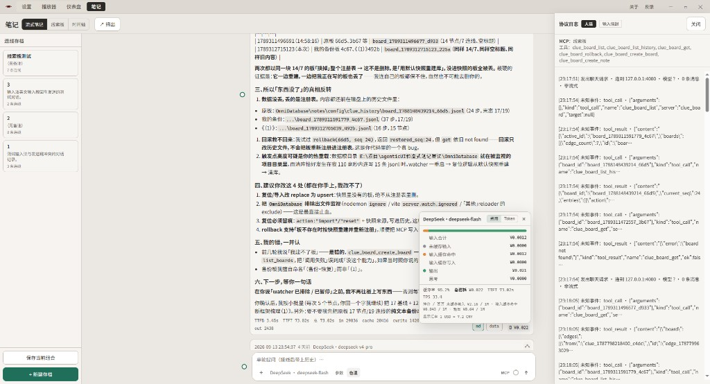
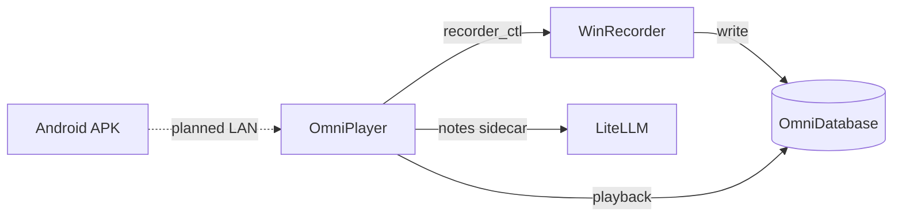

<p align="center">
  
</p>

<h1 align="center">OmniTrace</h1>

<p align="center"><strong>Prajna Plan</strong> · local-first Windows capture, replay, and notes</p>

<p align="center">
  <a href="README.md"></a>
  <a href="README.en.md"></a>
  <a href="https://github.com/Fortda/omnitrace/releases/latest"></a>
  <a href="LICENSE"></a>
  <a href="https://github.com/Fortda/omnitrace"></a>
</p>

**OmniTrace** is a Prajna Plan terminal for intelligence and information capture, and for maintaining a run log of a phenomenal-world model. It aims to extend how far and how finely you can sense the spatiotemporal causal network of the phenomenal world.

Repo: <https://github.com/Fortda/omnitrace> · License: [MIT](LICENSE)

By default everything is written under local `OmniDatabase/`. **Nothing is uploaded.** Do not commit API keys, cookies, recordings, or the database.

The Windows shell is still being built and polished. **The Android app is currently almost unusable** (lots of bugs); `omnitrace_android/` is a sketch, not a daily driver. The intent is later **LAN sync with the PC** on your own network — not uploading traces to someone else’s server.

## Interface

<p align="center"></p>

<p align="center"></p>

<p align="center"></p>
<p align="center"></p>
<p align="center"></p>
<p align="center"></p>

<p align="center"></p>
<p align="center"></p>
<p align="center"></p>
<p align="center"></p>

## What it does

- **WinRecorder** (`omnitrace_input.exe`): records mouse, keyboard, which window is focused, and the desktop in the background on Windows. Closing the player window does not stop recording. Use it later to replay “what was on screen then,” and for the dashboard timeline and stats.
- **Player**: replay a day. Drag the timeline at the bottom. It reconstructs the windows as they were — **not** a video file.
- **Dashboard**: see which programs you spent time on, plus charts, machine status (network, memory, disk throughput, and so on), and a sleep guess. Data stays on this computer; it is not uploaded to someone else’s server.
- **Streaming notes**: chat with an assistant on this machine. For example:
  - The assistant may only use tools you have checked, such as reading local files you allow (**do not send keyboard logs to a model** — see the warning below)
  - Let the assistant write sticky notes and lines on the clue board, and restore earlier versions
  - Plain chat, with conversation history kept
  - Cost estimates from the model’s list price and actual usage (shown in CNY or USD)
  - A log of requests sent to the model
  - Per-model settings such as thinking depth; providers and keys live under Settings → Language models
- **Clue board**: a 2D canvas of sticky notes and lines for ideas, people, and cause-and-effect.
- **Android** (`omnitrace_android/`): a phone trial you install yourself. **Almost unusable today.** The plan is later to talk to the PC on your own local network. It is not in the Windows app yet.

**Keyboard-log warning:** Capture files record real keystrokes. Sending them to any cloud model is sending passwords, DMs, one-time codes, and everything you typed. The in-app assistant must not read the keyboard capture file (`trace_DD.bin`). If you enlarge what tools the assistant can use, make sure it still cannot see keystrokes.

## Architecture

The player starts and stops the recorder. Data lives in `OmniDatabase/`. Notes talk to LiteLLM through a sidecar. Full contracts (currently in Chinese): [docs/architecture/OVERVIEW.md](docs/architecture/OVERVIEW.md).



## Install (Windows)

For everyday use you do not need a developer toolchain. You need **Windows 10 or 11 (64-bit)**.

1. Open [Releases](https://github.com/Fortda/omnitrace/releases/latest)
2. Download **`OmniTrace-…-windows-x64.zip`** (this zip is the one you want: player + recorder)
3. Unzip the whole folder and double-click **安装到本机.bat** (Install on this PC)
4. Open **OmniTrace** from the desktop shortcut

Data lives under your user folder `OmniTrace\OmniDatabase` and is **not uploaded**. Uninstalling the app does not delete that folder.

Windows may say “Windows protected your PC”: **More info → Run anyway** (builds are unsigned). If a double-click does nothing: Properties on the exe → Unblock.

If the Release has no zip yet, that tag has no installer attached. Wait for the next one, or build from source below.

How a maintainer cuts the zip and attaches it: [docs/releasing.md](docs/releasing.md).

### From source (development)

The stable copy goes to `%LOCALAPPDATA%\OmniTrace`, with a pointer at the repo `OmniDatabase/`:

```powershell
.\scripts\install-stable.ps1
# or
.\omniplayer\package.ps1 -Install
```

Development: `cd omniplayer && npm run tauri dev`, or `scripts/run-app.bat` at the repo root. The recorder is a detached background process; quitting the window does not stop it.

## Docs

| Doc | Audience |
|-----|----------|
| [README.md](README.md) | Chinese intro |
| [README.en.md](README.en.md) | English intro |
| [CHANGELOG.md](CHANGELOG.md) | What changed in a release |
| [docs/architecture/](docs/architecture/README.md) | How the system is shaped (overview in Chinese) |
| [docs/adr/](docs/adr/README.md) | Why we chose it (ADRs) |
| [docs/releasing.md](docs/releasing.md) | Download notes; how we cut a zip |

## Roadmap

Mentioned here only — not implemented yet:

- **Batch import of e-wallet statements** (files stay on disk; not uploaded)
- **Recorder / player module plugin ABI** (paired interfaces: third-party modules write on the capture side and enact an agreed visualization / window architecture in OmniPlayer; the built-in module list is not a hot-load workshop)
- **Dashboard workshop** (share/install interfaces for stats charts and dashboard views — modules, charts, layouts; user traces are not uploaded by default)
- **Phone ↔ PC LAN sync** (the Android capture app is almost unusable today; not a shipping mobile product)

Local-first stays the rule: capture, notes, and any future bill import do not ship the library to someone else's server. A later sharing platform would still not upload `OmniDatabase` by default.

## Contributing

Bugs and ideas: [GitHub Issues](https://github.com/Fortda/omnitrace/issues). The in-app Feedback button opens the same place.

Keep `OmniDatabase/`, secrets, recordings, and prompt files on your machine. Screenshot notes: [docs/images/README.md](docs/images/README.md).

## License

[MIT](LICENSE) © 2026 Fortda
