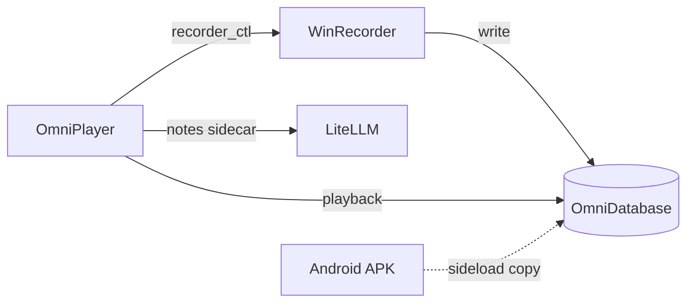

**中文** | [English](README.en.md)

<p align="center">
  
</p>

<h1 align="center">OmniTrace</h1>

<p align="center"><strong>般若计划</strong>（Prajna Plan）· 本机优先的 Windows 采集、回放与笔记壳</p>

<p align="center">
  <a href="LICENSE"></a>
  <a href="https://github.com/Fortda/omnitrace"></a>
</p>

仓库：<https://github.com/Fortda/omnitrace> · 许可：[MIT](LICENSE)

数据默认只写本机 `OmniDatabase/`，**不上传**。请勿把 API Key、Cookie、录像或数据库推进 Git。

## 界面示意

四标签 OmniPlayer 壳的**示意图**（奶油纸风格，不是产品截图）。真实截图会在空数据、无密钥的环境里补拍，见 [docs/images](docs/images/README.md)。`settings.png` / `player.png` / `dashboard.png` / `notes.png` 尚未收录。


打开 SVG 文件时，顶栏标签会循环切换四个页面。GitHub README 里的 `` 常常只显示第一帧，这不是产品演示 GIF。

## 它做什么

- **WinRecorder**（`omnitrace_input.exe`）：后台记录键鼠物理流与窗口环境。关壳不停录。
- **OmniPlayer**：设置、回放 / 直播、仪表盘、流式笔记与线索板。
- **Android**（`omnitrace_android/`）：边载采集 APK，本期不进 Windows 壳。

关于页表述：情报和信息采集，以及现象世界模型运行日志。

## 架构

Player 启停采集器；数据落 `OmniDatabase/`；笔记经 sidecar 走 LiteLLM。细节见 [docs/architecture/OVERVIEW.md](docs/architecture/OVERVIEW.md)。



## 安装（Windows）

稳定版装到 `%LOCALAPPDATA%\OmniTrace`：

```powershell
.\scripts\install-stable.ps1
# 或
.\omniplayer\package.ps1 -Install
```

GitHub **Release → Assets** 上计划提供：NSIS 安装包 + 便携 zip（zip **不含** `OmniDatabase`）。打法见 [docs/releasing.md](docs/releasing.md)。

开发：仓库根 `打开 OmniTrace.bat`，或 `cd omniplayer && npm run tauri dev`。采集器独立后台，关壳不会停录。

## 文档

| 文档 | 给谁 |
|------|------|
| [README.md](README.md) | 中文入门 |
| [README.en.md](README.en.md) | English intro |
| [CHANGELOG.md](CHANGELOG.md) | 发版时看什么变了 |
| [docs/architecture/](docs/architecture/README.md) | 当前系统长什么样 |
| [docs/adr/](docs/adr/README.md) | 架构决策（为什么） |
| [docs/releasing.md](docs/releasing.md) | 打 tag、挂 Assets、公开初版 orphan 推送 |

## 路线图

只列方向，尚未实现：

- **电子钱包账单批量导入**（账单文件仍只落本机，不上传）
- **采集器 / 播放器模组插件接口**（成对 ABI：第三方模组写记录侧，并按约定的可视化 / 窗体架构在 OmniPlayer 里演绎；现有内置模组不是热加载）
- **仪表盘创意工坊**（统计图 / 仪表盘视图的分享与安装接口；分享模组、图表、布局，默认不上传用户轨迹）

数据始终 local-first：采集、笔记、账单导入都不把库送到别人的服务器。以后若有分享平台，也不默认上传 `OmniDatabase`。

## 贡献

问题与想法请开 [GitHub Issue](https://github.com/Fortda/omnitrace/issues)。壳内「反馈」也可跳到同一入口。

请把 `OmniDatabase/`、密钥、录像和提示词原文留在本机。补真实截图时用空数据环境，见 [docs/images/README.md](docs/images/README.md)。

## 许可

[MIT](LICENSE) © 2026 Fortda
