<p align="center">
  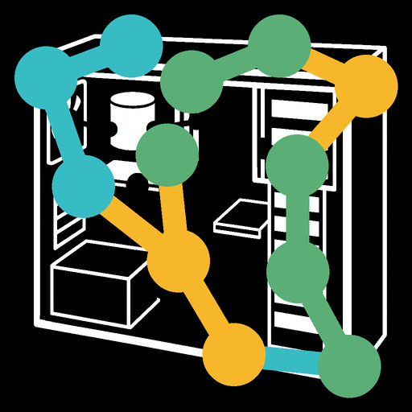
</p>

<h1 align="center">留痕</h1>

<p align="center">
  <a href="README.md"></a>
  <a href="README.en.md"></a>
  <a href="https://github.com/Fortda/liuhen/releases/latest"></a>
  <a href="LICENSE"></a>
  <a href="https://github.com/Fortda/liuhen"></a>
</p>

**留痕**（英文 Liuhen）是辅助人尽可能记录和模拟世界的软件，也可以用来自我侧写；不过主要是用来拿跟ai的聊天记录当笔记方便本地管理，轻量api协议转发器套壳，也可以选择让他帮你记一些简单的可视化笔记，后续可能会弄更复杂一点的笔记

外行，**100%面向ai编程**，用的cursor

**软件定位**是一套情报和信息采集与现象世界模型运行日志维护、管理的终端；意在扩展感知在现象世界时空因果链网络上的深度与广度，我打算叫这种辅助人观测世界的项目为般若计划很帅

仓库：<https://github.com/Fortda/liuhen> · 许可：[MIT](LICENSE)

数据默认只写本机 `OmniDatabase/`，**不上传**。请勿把 API Key、Cookie、录像或数据库推进 Git。

Windows 壳还在开发和打磨，很多地方会改。比如卡顿和加载慢的问题，国际ai走梯子调用问题，各种ui小细节和美化。**手机端目前几乎没法用**（大量 bug）；仓库里的 `omnitrace_android/` 只是雏形。打算以后在**本机局域网**和电脑联动，现在还没做到能用，也**不会**把数据传到别人的服务器。

截图放在下面各功能旁边。

## 它做什么

- **WinRecorder**（`omnitrace_input.exe`）：在 Windows 后台记录鼠标、键盘、当前在用哪个窗口，以及桌面。关掉播放器窗口，采集仍在后台继续。用来事后回放「当时屏幕上有什么」，也给仪表盘做时间轴和统计。开关在设置页。

  <p align="center">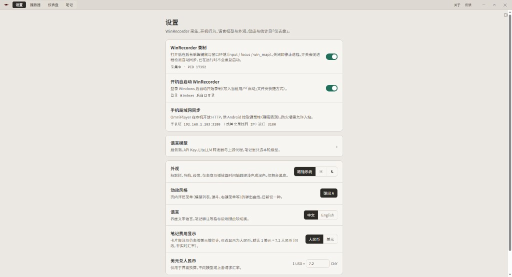</p>

  键鼠记录已经压缩过，按每天高强度用机约 8 小时算，一年大概不会超过 4 GB，本机高峰一天约 15 MB；窗口那些其它日志还没这么压。

- **播放器**：按天回放。底栏时间轴可以拖动。滚动和缩放可在设置的「滚动与缩放」里调，仪表盘和笔记时间轴也用这一套。它会按当时开着的窗口把画面摆回来，**不是**一份录像文件。整理数据和载入还偏慢，需要再优化。

  <p align="center">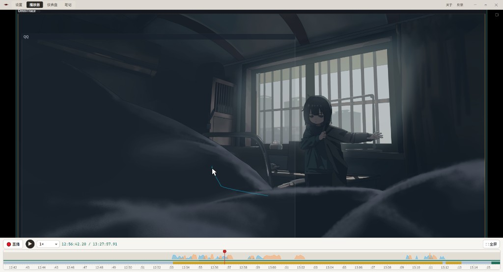</p>

- **输入法（识别中）**：Windows 上已经能经小狼毫侧路记下当时的组字和候选，播放器按结构重画（不是抄皮肤）。另外正在识别一些开源输入法的可视化架构，还不是通用输入法可视化成品。

- **仪表盘**：看自己把时间花在哪些程序上。整理数据和载入同样还偏慢。统计图、时间轴以及显示效果，可以在笔记里用已勾选的工具让助手帮你揉；以后路线图里有创意工坊式的分享/安装，现在没有上架商店。

  <p align="center">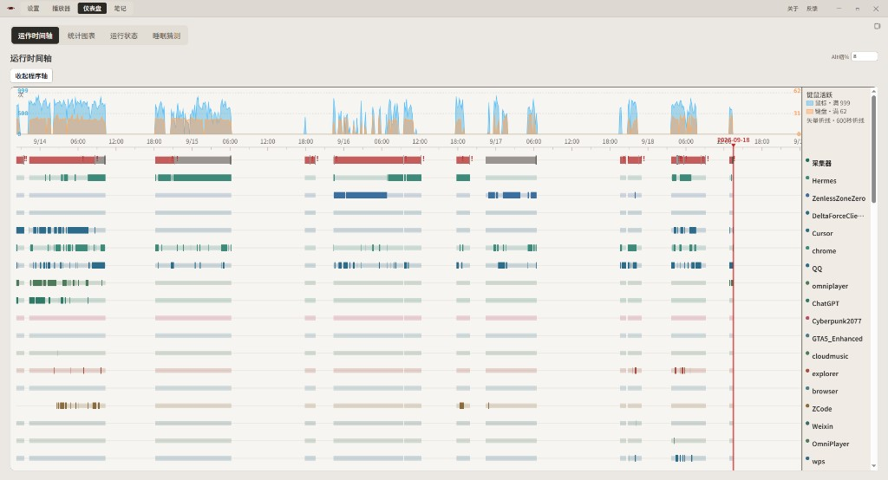</p>

  还有统计图表：

  <p align="center">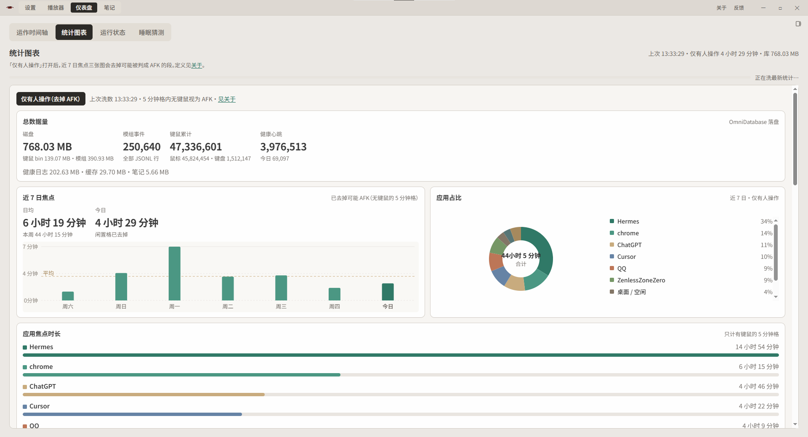</p>

  键盘按键频率：

  <p align="center">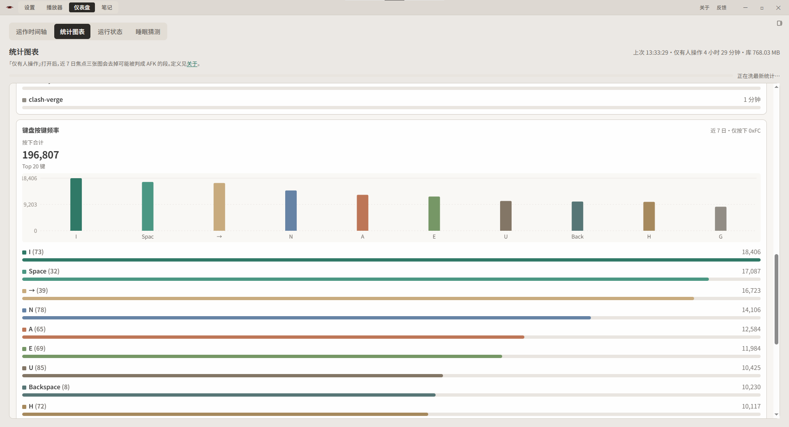</p>

  机器运行状态（网卡、内存、磁盘吞吐等）：

  <p align="center">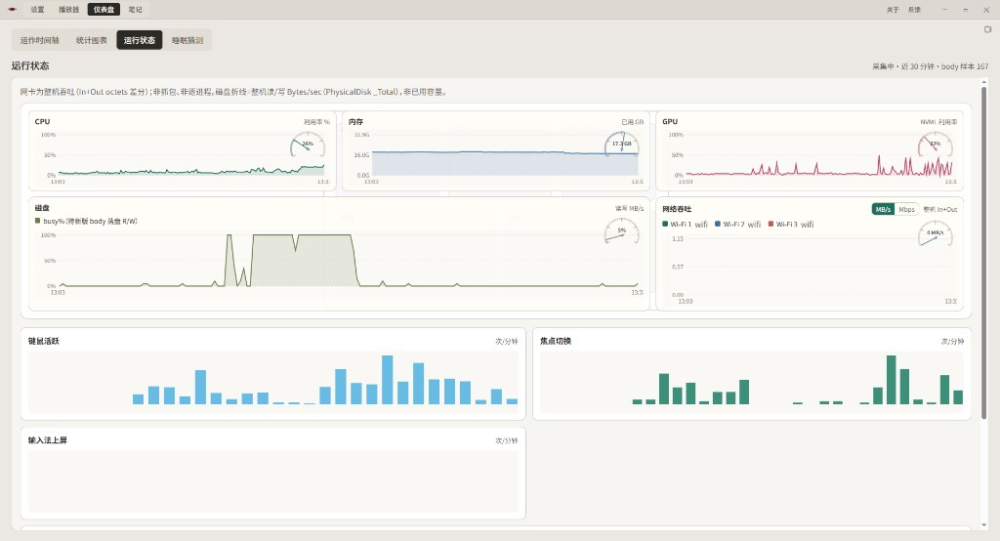</p>

  以及睡眠猜测。数据留在本机，不会上传到别人的服务器。

  <p align="center">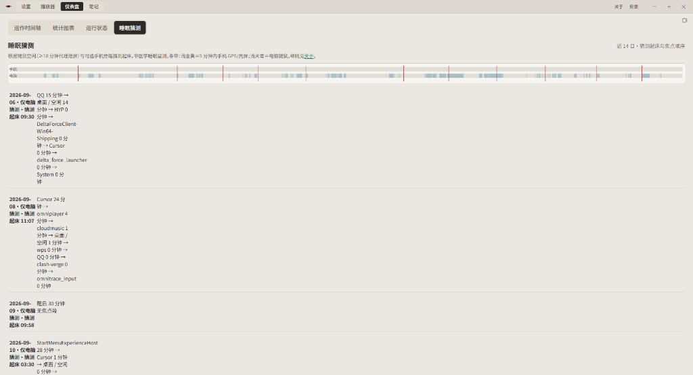</p>

- **流式笔记**：在这台电脑上和助手对话。界面还要打磨；助手走 LiteLLM 中转，回复有时会顿一下。图表、时间轴、几乎任何显示效果，都希望能按你的想法揉——靠应用内助手和你勾选过的工具，不是已经上线的工坊商店。

  <p align="center">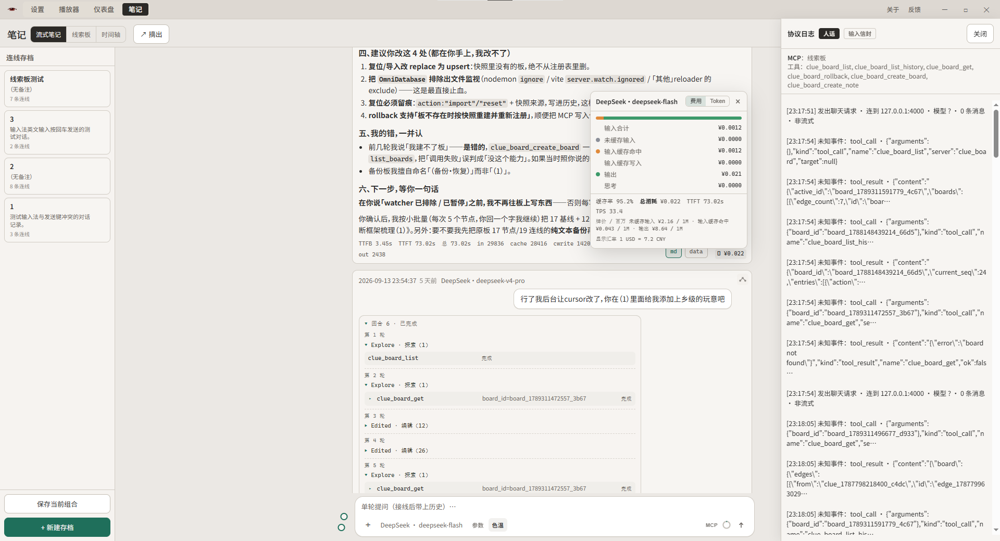</p>

  例如：
  - 助手只能调用你勾选过的工具，用来读本机允许的文件（**不要把键盘记录交给模型**，见下方警告）
  - 让助手在线索板上写便签、连线，也能回到之前的版本
  - 纯聊天，并保留对话历史
  - 按模型标价和实际用量估算费用（可显示人民币或美元）
  - 查看发给模型的请求日志（上图右侧）
  - 按模型调节思考深度等参数；服务商与密钥在设置 → 语言模型
  - 在时间轴上按时间看对话卡片

  勾选 MCP 工具：

  <p align="center">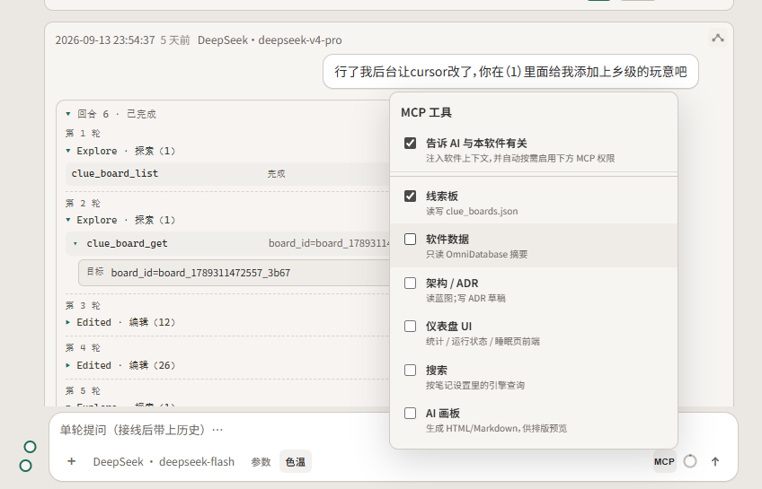</p>

  模型列表与价表：

  <p align="center">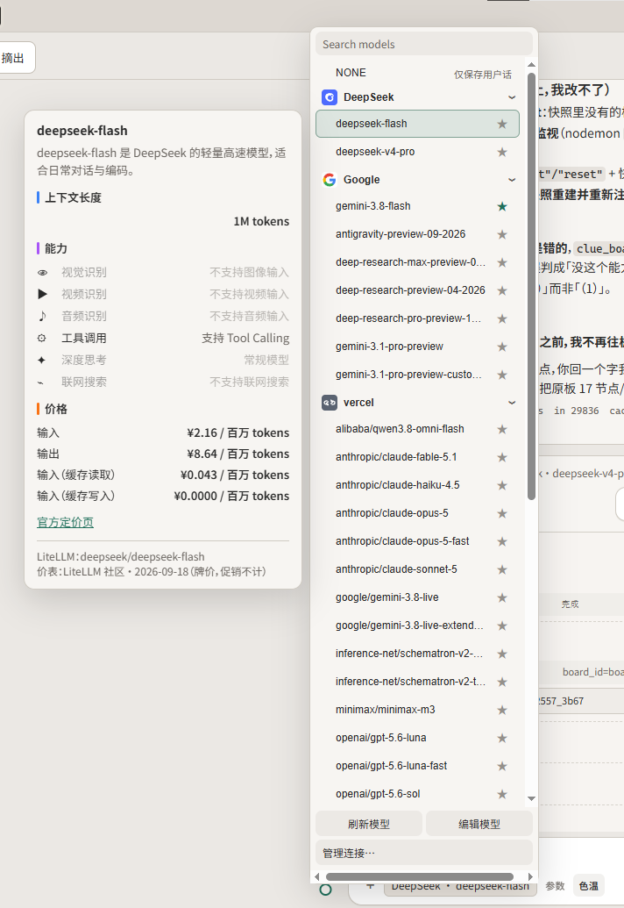</p>

  按模型调节参数：

  <p align="center">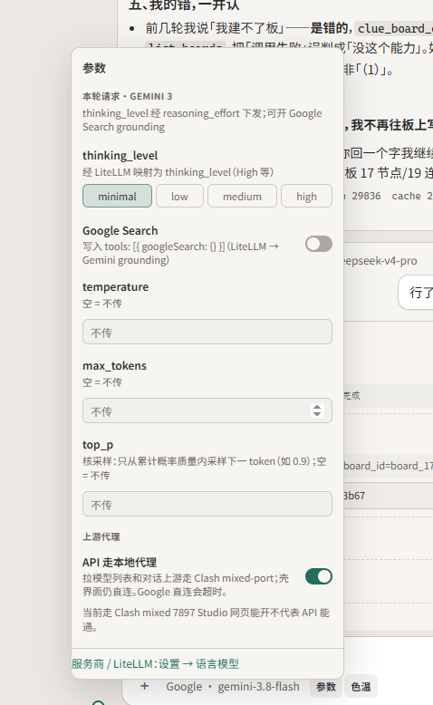</p>

  笔记时间轴：

  <p align="center">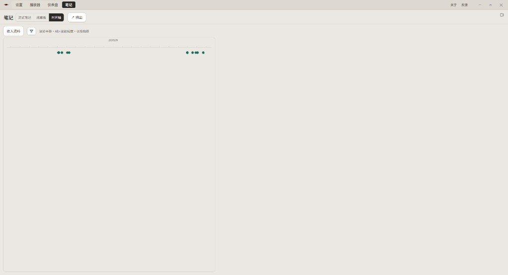</p>

- **线索板**：一张二维画布，用便签和连线整理思路、人物和因果。

  <p align="center">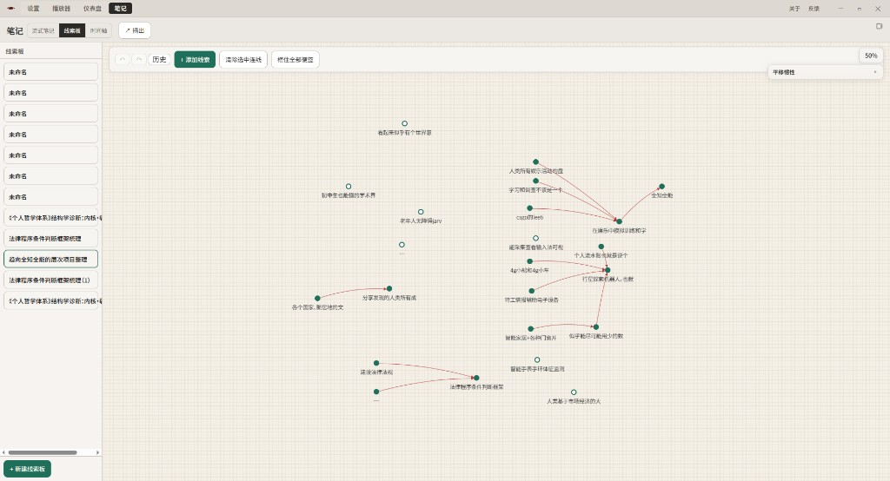</p>

- **Android**（`omnitrace_android/`）：从 Releases 下载 APK 自己边载的手机试用版，**目前几乎没法用**。数据只留在手机上；以后打算在本机局域网和电脑联动，现在还没有接到 Windows 应用里。

**键盘日志警告：** 采集文件会记下真实按键。把它交给任何云端模型，等于交出密码、私信、验证码和所有打过的字。笔记里的助手不该去读键盘采集文件（`trace_DD.bin`）。如果你扩大助手能用的工具，先确认它仍然看不到按键记录。

## 架构

播放器启停采集器；数据落 `OmniDatabase/`；笔记经 sidecar 走 LiteLLM。细节见 [docs/architecture/OVERVIEW.md](docs/architecture/OVERVIEW.md)。

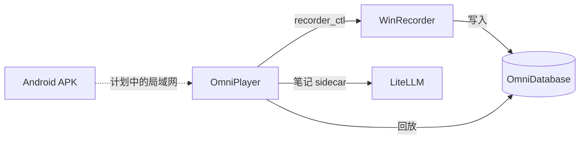

## 安装（Windows）

只要日常用，不用装开发环境。需要 **Windows 10 或 11（64 位）**。

1. 打开 [Releases（发布页）](https://github.com/Fortda/liuhen/releases/latest)
2. 下载 **`Liuhen-…-windows-x64-setup.exe`**（播放器 + 采集器）
3. 下一步、下一步。默认装到当前用户的 `%LOCALAPPDATA%\OmniTrace`，一般不用管理员（磁盘文件夹名未改，兼容旧版）
4. 用桌面上的 **留痕** 打开

数据在你的用户目录 `OmniTrace\OmniDatabase`，**不会上传**，也**不会**打进安装包。卸载（设置 → 应用 → 留痕）只删程序，不删这份数据。

已装过的朋友可在 OmniPlayer **设置**里点「检查更新」，不必每次用浏览器再下完整 setup.exe（首次安装仍用 setup.exe）。

也可以下 **zip**，解压后双击 **安装到本机.bat**，效果相同。

Windows 可能提示「未知应用」：选 **更多信息 → 仍要运行**（目前没有代码签名）。若双击没反应，右键 exe → 属性 → 解除锁定。

若发布页下面还没有 setup.exe，说明这一版还没挂上安装包。可以等下一版，或按下面从源码自己编。

维护者怎么打包、怎么挂到 GitHub： [docs/releasing.md](docs/releasing.md)。

### 从源码安装（开发）

稳定版装到 `%LOCALAPPDATA%\OmniTrace`，数据指针指向仓库里的 `OmniDatabase/`：

```powershell
.\scripts\install-stable.ps1
# 或
.\omniplayer\package.ps1 -Install
```

开发运行：`cd omniplayer && npm run tauri dev`，或仓库根 `scripts/run-app.bat`。采集器独立后台，关掉窗口不会停录。

## 安装（Android）

这是给普通人边载的试用 APK，**几乎没法用**（大量 bug），不是能天天开着的成品。数据只写在这台手机上，**不会上传**，也**不会**打进 APK。以后才打算在本机局域网和电脑联动，现在没有。

1. 打开 [Releases（发布页）](https://github.com/Fortda/liuhen/releases/latest)
2. 下载 **`Liuhen-…-android.apk`**
3. 用手机打开这个文件安装（系统会说「未知来源」：允许这一个文件即可）
4. 国产手机还要在设置里关掉电池优化、打开自启动，否则后台采集很容易被杀掉

不要把手机里的记录传到别人的服务器。若这一版 Release 下面没有 APK，等下一版，或让会编的人在电脑上跑 `omnitrace_android/package.ps1`。

## 文档

| 文档 | 给谁 |
|------|------|
| [README.md](README.md) | 中文入门 |
| [README.en.md](README.en.md) | 英文入门 |
| [CHANGELOG.md](CHANGELOG.md) | 发版时看什么变了 |
| [docs/architecture/](docs/architecture/README.md) | 当前系统长什么样 |
| [docs/adr/](docs/adr/README.md) | 架构决策（为什么） |
| [docs/releasing.md](docs/releasing.md) | 怎么下载；维护者怎么打 setup.exe / zip / APK |

## 路线图

只列方向，尚未实现：

- **电子钱包账单批量导入**（账单文件仍只落本机，不上传）
- **采集器 / 播放器模组插件接口**（成对 ABI：第三方模组写记录侧，并按约定的可视化 / 窗体架构在 OmniPlayer 里演绎；现有内置模组不是热加载）
- **仪表盘创意工坊**（统计图 / 仪表盘视图的分享与安装接口；分享模组、图表、布局，默认不上传用户轨迹）
- **手机与电脑本机局域网联动**（Android 采集目前几乎不可用，先别当真机产品）

数据始终本机优先：采集、笔记、账单导入都不把库送到别人的服务器。以后若有分享平台，也不默认上传 `OmniDatabase`。

## 贡献

问题与想法请开 [GitHub Issue](https://github.com/Fortda/liuhen/issues)。设置 → 关于与反馈 也可跳到同一入口。

请把 `OmniDatabase/`、密钥、录像和提示词原文留在本机。截图约定见 [docs/images/README.md](docs/images/README.md)。

## 许可

[MIT](LICENSE) © 2026 Fortda
